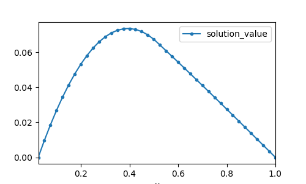

# Sparse Matrix library in Fortran90

Surprisingly I have not found a good sparse matrix library for
`Fortran90` on the internet when I needed it. Therefore, I wrote this
object-oriented library to implement sparse matrices. This library
facilitated defining and manipulating such matrices. 

## Available sparse matrix representations
1. COO (coordinate):                  `type(spmat)`
2. CSR (compressed storage row):      `type(sp_csr)`

## Main subroutines to manipulate sparse matrix
| subroutine        | description |
|---|---|
| buildspmat        | builds a sparse matrix in COO format                 |
| clearspmat        | destroy a sparse matrix in COO format                |
| writespmat        | writes a sparse matrix of COO format in a file       |
| showspmat         | shows a sparse matrix of COO format in terminal      |
| readspmat         | read an entry of a COO matrix and return the value   |
| setvalspmat       | set an entry in a COO matrix at a given position |
| insert2spmat      | inserts an entry in a COO matrix at a given position |
| insertblock2spmat | inserts a block COO matrix into another COO matrix   |
| SPtranspose       | transpose a COO matrix                               |
| alpha * Asp       | `alpha` is a real*8 and Asp is a COO matrix           |
| Asp * vec         | multiplies a COO sparse matrix to a vector           |
| Asp + Bsp         | sum of two sparse matrices. It might be expensive    |
| Bsp = Asp         | Assign Asp to Bsp                                    |
| copysp2sp         | copy a COO matrix into another COO matrix            |
| buildsp_csr       | builds a CSR matrix                                  |
| sp_coo2csr        | converts a COO to CSR format                         |


# Example
Through an example we can see the usage of this library. The file
`src/test.f90` is solving a partial differential equation using a
finite difference method:

```fortran
!> @file test.f90
program test

  use sparsemat

  type(spmat)             :: A, K, Id       ! define two sparse matrix
  integer, parameter      :: len = 20       ! define the length of the matrices
  real (kind=spkind_real) :: f(len)         ! define the force vector
  real (kind=spkind_real) :: u(len)         ! define the solution vector
  real (kind=spkind_real) :: h              ! mesh size
  
  Id = diag_sp(len)             ! building Identity matrix

  K  = diag_sp(len,1) + diag_sp(len,-1) ! building stiffness matrix
  K  = K + (-2.0) * diag_sp(len)        ! building stiffness matrix

  h = 1.0 / (len-1)

  A = h**(-2)*K + 0.25 * Id

  call setvalspmat(A,1,1,1.0)     ! set boundary conditions
  call setvalspmat(A,1,2,0.0)     ! set boundary conditions
  call setvalspmat(A,len,len,1.0) ! set boundary conditions
  call setvalspmat(A,len,len-1,0.0) ! set boundary conditions
  
  call showspmat(A)             ! inspecting the matrix by printing it
                                ! in terminal
  call writespmat("bin/matrix", A)

  f(1:(len/2)) = -1.0; f(1) = 0.0; f(len) = 0.0
  
  call solve_gmres(A, u, f, len, len, 1.0E-8, 1.0E-8)
  call writevector("bin/solution", u)
  
end program test
```

The output is saved in `bin/solution` and can be ploted using
`plot/plot.py`:


# External libraries

* Quick sort routine by *Brainerd, W.S., Goldberg, C.H. & Adams, J.C.*
  (1990) **Programmer's Guide to Fortran 90**, McGraw-Hill, pages 149-150.
* GMRES solver by *Lili Ju* (C version) and *John Burkardt* (Fortran
  version). See also **Templates for the Solution of Linear Systems:
  Building Blocks for Iterative Methods** (1994) SIAM.

